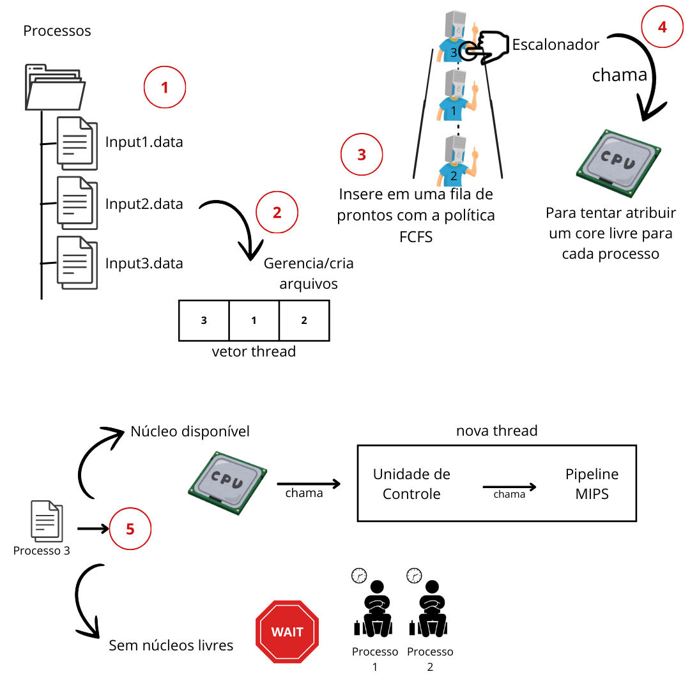

<h1 align="center" font-size="200em"><b>Desenvolvimento e Implementação de uma Arquitetura Multicore com Escalonamento e Gerência de Memória</b></h1>

<!-- imagem -->

## ✒️ Descrição
Este é um programa desenvolvido em C++ para a disciplina de Sistemas Operacionais. Este projeto foca no desenvolvimento de um sistema baseado em uma arquitetura multicore com execução de tarefas preemptivas. O sistema implementa a preempção quando o quantum atinge o valor zero, pausando o processo e retornando-o para a fila, mantendo-o no estado de bloqueado. O uso do mutex é essencial para evitar acessos concorrentes às regiões críticas, como o acesso ao Core disponível. A simulação foi projetada para demonstrar o gerenciamento eficaz de processos concorrenciais até o término do arquivo.

## 💻 Objetivo

O presente trabalho tem por objetivo desenvolver um sistema que atua como uma arquitetura multicore, com execução de tarefas preemptivas, proporcionando uma simulação realista do comportamento de um sistema operacional.

## 📄 Instruções do Arquivo .data

É necessário seguir os modelos de instruções descritos abaixo no arquivo .data para garantir o funcionamento correto do código e da arquitetura.

### Atribuição de Valores aos Registradores - Operação `=`  
O símbolo `=` é utilizado para atribuir um valor a um registrador. O primeiro termo representa o registrador e o segundo termo o valor atribuído. Por exemplo, `= 0 6` indica que o registrador de número 0 receberá o valor 6.

### 🔢 Operações Matemáticas 
As operações matemáticas são representadas pelos símbolos `+`, `/`, `*`, e `-`. Elas correspondem, respectivamente, às operações de adição, subtração, multiplicação e divisão. Essas operações são realizadas utilizando registradores como operandos. Por exemplo, `+ 0 1 0` indica que será realizada uma soma, com o resultado sendo salvo no registrador 0, utilizando os valores dos registradores 1 e 0.

### Loop `while` - Operação `@`
O símbolo `@` corresponde ao loop `while`. Por exemplo, `@ 0 1 4` significa somar os valores dos registros começando pelo índice 0 até o índice 1, repetindo essa operação 4 vezes de forma circular. O resultado final é salvo no primeiro registrador utilizado.

### Operação `if` - Operação `?`
A operação `if` é representada pelo símbolo `?`. Por exemplo, `? 0 1 <$` avalia se o valor no registrador 0 é menor que o valor no registrador 1. O resultado dessa operação é armazenado na memória principal, retornando 1 para verdadeiro (true) e 0 para falso (false).

### Pólitica de escalonamento  
Essa metodologia foi desenvolvida para garantir uma simulação realista e eficiente do comportamento de um sistema operacional multicore, permitindo a execução de tarefas concorrentes com controle e gerenciamento de processos.

### Diagrama
O fluxo do programa foi modelado de maneira a integrar os conceitos apresentados, estruturando a execução e gerência de processos, conforme ilustrado no diagrama a seguir.

  
  
<em> Fluxo da arquitetura </em>

## 🎯 Resultados

O sistema demonstrou a capacidade de realizar preempção quando o quantum atingia o valor zero, pausando o processo, retornando-o para a fila, mantendo-o no estado de bloqueado. Posteriormente executando-o novamente até o término do arquivo. Além disso, o uso do mutex foi essencial para não permitir que os processos acessassem a região crítica, que nesta etapa era o acesso ao Core disponível.

#### Exemplo de entrada e saída

| Input | Instruções                                     | Descrição                       | Ciclos |
|-------|------------------------------------------------|--------------------------------|--------|
| 1     | `= 0 4`                                        | Atribuir 4 ao registrador 0       | 3      |
|       | `= 1 5`                                        | Atribuir 5 ao registrador 1       | 3      |
|       | `- 0 1 0`                                      | Subtrair dos R 0 e 1 e armazenar em 0 | 5      |
| 2     | `= 0 6`                                        | Atribuir 6 ao registrador 0       | 3      |
|       | `= 1 7`                                        | Atribuir 7 ao registrador 1       | 3      |
|       | `+ 0 1 0`                                      | Somar dos R 0 e 1 e armazenar em 0 |  5      |

## 👾Compilação e execução
* Especificações da máquina em que o código foi rodado:
  * Processador Intel Core i7, 12th Gen;
  * Sistema Operacional Ubuntu 22.04.5;
  * 16GB de RAM.
* | Comando                |  Função                                                                                           |                     
  | -----------------------| ------------------------------------------------------------------------------------------------- |
  |  `make clean`          | Apaga a última compilação realizada contida na pasta build                                        |
  |  `make`                | Executa a compilação do programa utilizando o gcc, e o resultado vai para a pasta build           |
  |  `make run`            | Executa o programa da pasta build após a realização da compilação                                 |

## Contato

 
 Anna Laura Moura Santana

 <a href="https://t.me/annalaurams">
  
 

<a style="color:black" href="mailto:nalauramoura@gmail.com?subject=[GitHub]%20Source%20Dynamic%20Lists">
✉️ <i>nalauramoura@gmail.com</i>
</a>

  
 Jullia Fernandes

 <a href="https://t.me/JulliaFernandes">
  
 

<a style="color:black" href="mailto:julliacefet@gmail.com?subject=[GitHub]%20Source%20Dynamic%20Lists">
✉️ <i>julliacefet@gmail.com</i>
</a>
